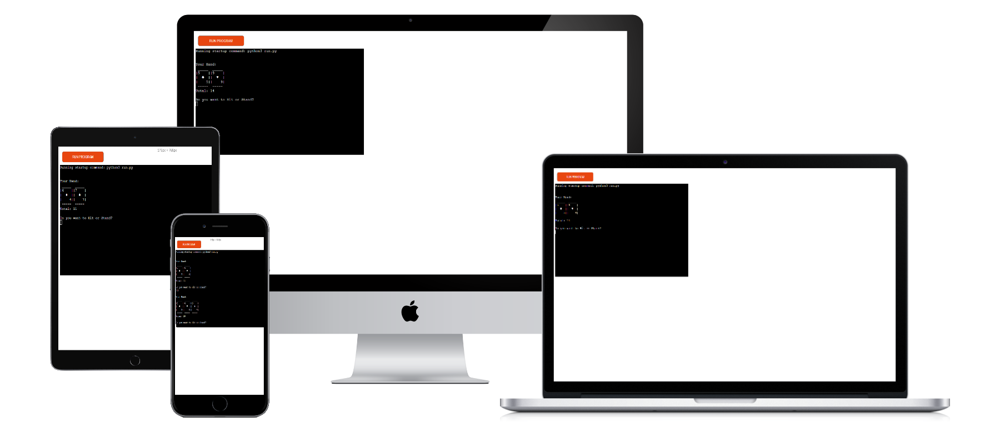
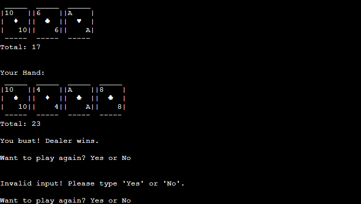
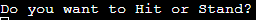
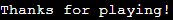
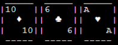

# [CLI Blackjack](https://commandline-blackjack-4f55abc96ef3.herokuapp.com)

Command Line Blackjack is a Python-based recreation of the classic card game, designed to be played in the terminal. 
Players compete against the dealer by trying to get as close to 21 as possible without exceeding it. 

The game incorporates intuitive text-based gameplay, visually engaging ASCII art for cards, and a simple replay feature to allow multiple rounds in a single session. 
This project demonstrates core Python concepts such as loops, functions, conditional statements, and user input handling, while offering an enjoyable gaming experience.

#

### Screenshots

(_Gameplay Screenshot_)

#

## Rules

- The goal is to have a hand value closer to 21 than the dealer, without exceeding 21 (busting).
- Number cards (2-10) are worth their face value.
- Face cards (Jack, Queen, King) are worth 10.
- Aces can be worth 1 or 11, whichever benefits the hand.
- The dealer must draw cards until their total is at least 17.
- If your hand exceeds 21, you bust and lose the game.
- If the dealer’s hand exceeds 21, the dealer busts, and you win.
- If both hands have the same value, the game is a tie (push).

## How to play

1. At the start of the game:
    - The player and dealer are each dealt two cards.
    - The player’s cards and total hand value are displayed.

2. Hit or Stand:
    - `'Hit'`: Take another card to increase your total hand value.
    - `'Stand'`: Keep your current hand and end your turn.
    - The dealer will then play according to the rules (draw until their total is at least 17).

3. Determine the Winner:
    - The player wins if:
        - Their total is closer to 21 than the dealer’s.
        - The dealer’s total exceeds 21 (bust).
    - The game ends in a tie (push) if both totals are equal.

4. Play Again:
    - After the result is displayed, you will be asked if you want to play another round.
    - Type `'yes'` to play again or `'no'` to exit the game.
    - If an invalid response is entered, you will be prompted to try again.

            
## Features & Design

### Hit or Stand
- Players choose to hit or stand, adding strategy to the gameplay.

    

### Want to play again?
- After each round, players are prompted to play again with a simple yes or no question.

    

    - If `'No'`:

        

### Invalid User Input
- If invalid input is entered, an error message will appear, prompting them to try again.

    

### ASCII Art Cards
- The game features visually appealing ASCII art for cards, adding clarity and enhancing the player's experience by making the card visuals more engaging and immersive in the terminal.

    

## Development & Deployment

### How This Project Came to Life?

- The inspiration for this project came from exploring `Python's random library`. I realized that the logic of a card game like Blackjack closely aligns with the math behind shuffling and randomness. 

    The concept clicked when I thought about how a deck of cards could be represented as a list in Python. By combining this with the `.pop()` method, I could mimic the dealer at a table, "taking the last card from the deck," just as `.pop()` removes the last item from a list. 
    
    This simple yet powerful connection between Python's functionality and real-world card mechanics became the foundation for building my Command Line Blackjack game.

### Tools Used

- This project was developed using `Gitpod`, a cloud-based IDE that allowed seamless coding and testing. Git was used for version control, with frequent commits to ensure a clean workflow. Developing the game logic involved using Python's random library and list methods like .pop() to mimic real-world card mechanics. 

    The `ASCII art` for cards was designed using `Code Pilot`, adding a visually appealing and immersive element to the terminal gameplay. Debugging and improving input handling were key challenges that helped me enhance my problem-solving skills.

### Deployment
- The project is hosted on `GitHub` and automatically deployed to `Heroku` using GitHub's integration with Heroku. Each commit to the main branch triggers an automatic deployment, ensuring the latest code is live. 
- [Live Link](https://commandline-blackjack-4f55abc96ef3.herokuapp.com)

    ### Testing

    #### Local Testing

    - The game was thoroughly tested in the local terminal throughout development to ensure all features, including gameplay logic, input handling, and ASCII art display, functioned as intended.

    #### Heroku Testing

    - After deployment, the app was tested on Heroku to confirm that all features worked correctly in the deployed environment. Additional testing ensured no issues arose from Heroku's runtime environment.

    #### Validator - [CI Python Linter](https://pep8ci.herokuapp.com)

    - No errors returned - PEP8

    ### Bugs

    - Identified and resolved a looping issue that caused the main game methods to run twice. Implemented a restructuring of the game loop to ensure the methods execute only once per round, eliminating the issue and ensuring _no bugs in the final version._

## Future Features

- ### Betting system

    I want to enhance the game by allowing players to start with a set amount of money or credits, which they can use to place bets. This feature would make the gameplay more engaging and add an element of strategy.

- ### Timed Output for Greater Suspense

    I want to improve the game experience by controlling how the results are displayed in the terminal. Instead of printing all information at once, the game could reveal the dealer’s hand and the player’s hand one at a time, simulating the pacing of a real Blackjack game. This would build suspense and excitement, especially leading up to the winning result.

## Credits

- Code Institute for the repository template
- Code Pilot for the ASCII and debugging
